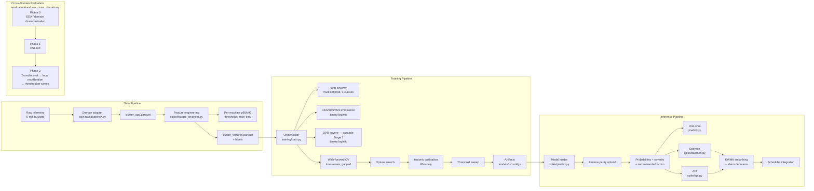

# Theory & Methodology — CPU Spike Predictor

This document covers the statistical and machine-learning theory behind the system: the
learning paradigm, loss functions, calibration mechanics, drift detection math, and the
reasoning a reviewer would probe. It complements `technical_report.md` (empirical results,
ablations, rejected approaches) and `advanced_reference.md` (CLI and operational reference) —
those two answer "what happened and how do I run it"; this one answers "why is it built this
way." All code references point at file:line in this repository so claims here can be checked
directly rather than taken on faith.

---

## Table of Contents

1. [System Overview](#1-system-overview)
2. [Learning Paradigm](#2-learning-paradigm)
3. [Core Learner — Gradient-Boosted Trees](#3-core-learner--gradient-boosted-trees)
4. [Loss Functions](#4-loss-functions)
5. [Class Imbalance Strategy](#5-class-imbalance-strategy)
6. [Calibration as a Separate Learning Step](#6-calibration-as-a-separate-learning-step)
7. [Decision Policy — Threshold Selection](#7-decision-policy--threshold-selection)
8. [Metrics Glossary](#8-metrics-glossary)
9. [Temporal Generalization & Leakage Prevention](#9-temporal-generalization--leakage-prevention)
10. [Domain Shift — Population Stability Index](#10-domain-shift--population-stability-index)
11. [Cross-Domain Transfer Protocol](#11-cross-domain-transfer-protocol)
12. [Uncertainty Quantification](#12-uncertainty-quantification)
13. [Limitations & Anticipated Questions](#13-limitations--anticipated-questions)

---

## 1. System Overview



Four stages, each with one job: **Data** turns raw per-task telemetry into a per-machine
5-minute time series with programmatically derived spike labels; **Training** fits four
XGBoost models on the same 40-feature table; **Inference** reloads those artifacts and
reproduces the exact same feature-engineering logic at serving time (feature parity is the
thing that most commonly breaks in production ML systems, so it is a single shared code path,
not a reimplementation); **Evaluation** answers "does this still work on data the model has
never seen, from a different cluster entirely?" See `CLAUDE.md` for the directory layout and
`technical_report.md` §3–§6 for the empirical detail behind each box.

---

## 2. Learning Paradigm

This is supervised learning on temporally ordered tabular data, with **weak, programmatic
labels** rather than human annotation: a "spike" is defined as CPU exceeding the machine's own
p95 (moderate) or p99 (severe) threshold in a future window — a deterministic rule applied to
the same telemetry used for features, looking forward instead of backward. This is the same
labeling philosophy used for offline anomaly-detection backtesting at large-scale operators,
and it is what makes retrospective evaluation on a new deployment domain possible without
anyone hand-labeling incidents (see `evaluation/evaluate_domain.py`, module docstring).

The system is **multi-task**: one 3-class multiclass task (60-minute severity) plus four
binary tasks (15m/30m/45m imminence, and an OVR-severe task used as a cascade second stage).
The tasks share the same 40-feature input table and are trained independently, not jointly —
there is no shared backbone or multi-head network; each is a separate XGBoost model reading
the same feature parquet.

---

## 3. Core Learner — Gradient-Boosted Trees

All four models are XGBoost gradient-boosted decision tree ensembles. Boosting is stage-wise
additive modeling:

$$F_M(x) = \sum_{m=1}^{M} \eta \, f_m(x)$$

where each tree $f_m$ is fit to the negative gradient (pseudo-residual) of the loss with
respect to the current ensemble prediction $F_{m-1}(x)$, and $\eta$ is the learning rate.
XGBoost specifically fits each tree using a second-order (Newton) approximation of the loss
plus an explicit regularization term on leaf weights and tree complexity — this is what
distinguishes it from plain gradient boosting and is why it tends to need less manual
regularization tuning than a naive implementation.

Tree ensembles were chosen over deep learning for this problem primarily because the input is
tabular with a moderate feature count (40) and a training set that, while large in row count,
has limited *effective* diversity (12,555 machines over 160 hours from a single trace). A
Temporal Fusion Transformer was tried and dropped for exactly this reason — see
`technical_report.md` §3 ("Why XGBoost over deep learning") and §7 for the empirical
comparison.

**Early stopping and depth:** `n_estimators=4000` with `early_stopping_rounds=150` in
production runs; `max_depth` and `learning_rate` are Optuna-searched, not fixed (best values
for the 60m model: depth 4, learning rate ≈0.01 — see `technical_report.md` §6). Shallow
trees with a low learning rate and many rounds is a standard bias/variance trade-off for noisy,
imbalanced tabular targets: it lets the ensemble average out label noise instead of
memorizing it.

---

## 4. Loss Functions

**60-minute severity model** — `multi:softprob`, softmax cross-entropy over 3 classes
(`spike/classifier.py:252`):

$$\mathcal{L}_{multi} = -\sum_{i} \sum_{k=1}^{K} y_{ik} \log p_{ik}$$

Early stopping uses `mlogloss`, not `aucpr` — XGBoost does not support `aucpr` as an eval
metric for multiclass objectives (see CLAUDE.md, "`aucpr` not usable for multiclass").

**Binary models** (15m/30m/45m imminence, OVR severe) — `binary:logistic`
(`spike/classifier.py:541`), evaluated with `aucpr` during early stopping:

$$\mathcal{L}_{bin} = -\sum_{i} \left[ y_i \log p_i + (1 - y_i)\log(1 - p_i) \right]$$

**Focal loss (tried, not in production).** For the OVR severe model, focal loss was tested as
a way to down-weight easy negatives and force the model toward hard positive cases:

$$\mathcal{L}_{focal} = -\sum_{i} \alpha_t (1 - p_t)^{\gamma} \log(p_t)$$

The hypothesis was that the model was learning "is this machine *currently* severe?" rather
than "will it *become* severe?", since `spike_now` dominates the OVR model's feature
importance (70.1% of gain). Result: **−0.016 PR-AUC regression** (0.312 vs 0.328 baseline).
Post-hoc analysis showed the `spike_now` dominance was not laziness — a machine already in a
severe state genuinely is the single most informative signal for staying severe next window,
and focal loss penalized exactly those easy-but-correct predictions. Reverted. Full writeup:
`technical_report.md` §7, "✗ Focal loss for OVR severe (Phase 10a)". It is documented here
because the *reasoning for rejecting it* is itself a useful methodological point, not because
it ships.

---

## 5. Class Imbalance Strategy

Two independent mechanisms, used at different levels:

1. **`scale_pos_weight`** (`spike/classifier.py:532`) — a scalar ratio (`n_negative /
   n_positive`) applied to the binary models' loss. `multi:softprob` has no equivalent —
   `scale_pos_weight` is binary-only in XGBoost, so the 60m multiclass model cannot use it
   directly.
2. **Structural rebalancing via cascade.** Rather than reweighting the loss for the rare
   severe class, the OVR severe model is trained only on spike-positive rows (moderate +
   severe), which raises the severe fraction from ~2.4% of all rows to ~19% of the subset it
   actually trains on. At inference, the 60m model gates which rows even reach the OVR model
   (only rows with `p(any spike) ≥ 0.15`). This turns an extreme 2.4%-positive problem into a
   moderate 19%-positive one *by construction*, rather than by loss surgery — see
   `technical_report.md` §3 and §7 ("✓ Cascade Stage 2 OVR severe").

---

## 6. Calibration as a Separate Learning Step

Isotonic regression is fit **per class, one-vs-rest**, on the validation split — a
non-parametric, monotone mapping from raw softmax score to calibrated probability. Because
each class is calibrated independently, the three calibrated probabilities no longer
necessarily sum to 1, so they are renormalized to the simplex after calibration:

```python
# evaluation/evaluate_cross_domain.py:307-316 (mirrors spike/classifier.py's calibration path)
row_sums = cal.sum(axis=1, keepdims=True)
cal = np.where(row_sums > 0, cal / row_sums, uniform)  # uniform = [1/3, 1/3, 1/3] fallback
```

This is explicitly a **post-hoc probability-learning step**, not model retraining — the tree
ensemble's ranking is fixed by the time calibration runs; only the mapping from score to
probability changes. Only the 60m severity model is calibrated in production. The binary
imminence models feed a ranking/threshold decision directly and don't carry per-class
probability semantics the way a 3-way severity call does, so calibration was judged
lower-value there (see the calibrators listed under `models/spike/` but not
`models/spike_15m/` in CLAUDE.md's artifact table).

---

## 7. Decision Policy — Threshold Selection

Ranking quality (AUC) and the deployed decision (an alarm fires or it doesn't) are
deliberately separated. The alarm threshold is chosen by a **grid sweep on the validation
split** — `np.arange(0.05, 0.96, 0.05)` (`evaluation/evaluate_cross_domain.py:407`) —
maximizing F1, then that single fixed threshold is evaluated once on the held-out test split.
Tuning it on test would leak evaluation information into the reported result and inflate the
deployed expectation.

**Playbook for choosing where on that curve to sit:**

| Situation | Move | Why |
|---|---|---|
| False alarms are costly (scheduler churn, unnecessary migrations) | Raise the threshold | Prioritizes precision; fewer, more trustworthy alarms |
| Missed spikes are costly (SLA violations, job eviction) | Lower the threshold | Prioritizes recall; accepts more false alarms to catch more true ones |
| No strong asymmetry | Pick near max-F1, then sanity-check alarms/day | Balances both, but always verify the resulting operational load is acceptable |

The threshold is always locked on validation, never test — see §9 and `advanced_reference.md`
for the `--alarm-threshold` CLI flag used to override it per deployment.

---

## 8. Metrics Glossary

| Metric | What it tells you | Best use | Watch out for |
|---|---|---|---|
| Precision | Among raised alarms, how many were correct | Alert-fatigue control | Can be high with very low recall |
| Recall | Among real spikes, how many were caught | Missed-incident / risk control | Can be high with too many false alarms |
| F1 | Precision/recall balance | Single operating-point score | Hides asymmetric business costs |
| PR-AUC | Positive-class quality across all thresholds | Imbalanced tasks (spikes are rare) | Moves with prevalence — not directly comparable across datasets with different base rates |
| ROC-AUC | Ranking quality, independent of threshold | Cross-domain / cross-dataset comparison | Can look deceptively good even with weak precision on rare positives |
| Macro PR-AUC (multiclass) | Equal-weighted average of per-class PR-AUC | Fair tracking of the rare severe class | Penalizes heavily if the severe class alone is weak, even when the dominant class is fine |
| Brier score | Calibration quality (squared error of probabilities) | Trusting probabilities downstream (e.g. in a scheduler's cost model) | A good ranker can still be poorly calibrated |
| ECE | Calibration gap, binned by confidence | Deployment readiness check | Sensitive to bin-count choice |
| Alarms/day | Operational load | On-call and scheduler capacity planning | Meaningless without reading it alongside precision/recall |

$$\text{Precision} = \frac{TP}{TP+FP} \qquad \text{Recall} = \frac{TP}{TP+FN} \qquad F_1 = \frac{2\,P\,R}{P+R}$$

**Reading order in practice:** model-quality layer first (PR-AUC / ROC-AUC) → operating-point
layer (threshold → precision/recall/F1/alarms-per-day) → probability-trust layer (Brier/ECE,
after calibration) → drift layer (the same metrics tracked over time and across domains). This
is also why **macro PR-AUC** — not accuracy, not plain PR-AUC on a pooled "any spike" label —
is the model's primary metric: the no-spike class is easy and would otherwise dominate any
unweighted score (CLAUDE.md, "Macro PR-AUC — primary metric for 60m model").

**Cross-domain comparison rule:** compare ROC-AUC first when base rates differ between
datasets, since PR-AUC's prevalence-sensitivity makes raw PR-AUC deltas hard to interpret
across domains; report PR-AUC alongside it with the prevalence stated explicitly. See
`technical_report.md` §10 for this in practice (Google vs Zabbix).

---

## 9. Temporal Generalization & Leakage Prevention

Two independent guarantees, enforced at different points in the pipeline:

- **No random shuffling, anywhere.** Splits are chronological (train 60% / val 20% / test
  20%), and cross-validation is walk-forward: 5 folds, expanding training window, with a
  **12-bucket gap** (= 1 full 60-minute horizon) between the end of train and the start of val
  in every fold, so no row in validation can share a label window with a row the model trained
  on (`technical_report.md` §6).
- **The leakage firewall.** Every history feature (`spike_in_last_*`, `cpu_vs_p95_delta`,
  etc.) is derived from `spike_now.shift(1)` — the *previous* bucket's status — never the
  current bucket's. Labels look forward from the *next* bucket. The shift on the feature side
  and the future window on the label side point in opposite directions and structurally cannot
  overlap. See CLAUDE.md, "Leakage Firewall," for the full feature list this applies to.

These are two separate failure modes (temporal leakage across a split boundary vs. same-row
feature/label leakage) and both are needed — closing one doesn't imply the other is closed.

---

## 10. Domain Shift — Population Stability Index

PSI is the metric used to decide whether a feature's distribution has moved enough between
training data and a new deployment domain to warrant concern:

$$\text{PSI} = \sum_{i} (a_i - e_i) \, \ln\!\left(\frac{a_i}{e_i}\right)$$

summed over bins, where $e_i$/$a_i$ are the expected (training) and actual (live) bin
proportions. It's used over KL divergence or Wasserstein distance because it's a single,
bounded, symmetric-for-moderate-shifts scalar that's interpretable by an operator without a
statistics background (`spike/psi.py`, module docstring).

Implementation details that matter, verified against `spike/psi.py:39-122`:

- **Bin edges come from the expected (training) distribution, not the actual one.** This
  guarantees every expected bin has ≥1 observation by construction, avoiding a
  divide-by-zero that fixed-width or actual-derived bins would risk.
- **Binary features get 2 exact bins**, `[-0.5, 0.5]` and `[0.5, 1.5]`, instead of quantile
  bins — quantiles over a `{0,1}`-valued feature collapse and produce degenerate edges.
- **`eps = 1e-4` pseudocount** on bin proportions prevents `log(0)` when a bin is empty in the
  live window (e.g. a spike-history feature that's all-zero during a quiet period). This
  slightly inflates PSI for a fully-shifted binary feature, which is a known, documented
  trade-off, not an oversight.
- **Thresholds** (`spike/psi.py:33-35`): `< 0.10` stable, `0.10–0.25` monitor, `0.25–0.50`
  significant shift / schedule retraining, `> 0.50` emergency rollback. These are the standard
  credit-risk-literature cutoffs, deliberately kept conservative for 5-minute telemetry
  (`spike/psi.py` docstring notes a PSI of 0.30 in CPU data could just as easily reflect a
  planned capacity event as permanent drift).
- **System-wide alert** (`spike/drift_monitor.py:76`) fires when **>10% of valid features
  exceed PSI 0.20** — a threshold deliberately set *below* the single-feature "monitor" cutoff
  (0.25), because many features moderately shifted together is a stronger and earlier signal
  of broad drift than any one feature crossing 0.25 alone.

---

## 11. Cross-Domain Transfer Protocol

`evaluation/evaluate_cross_domain.py` runs three phases, in order, on a new dataset:

1. **Phase 0 — EDA / domain characterization.** Per-node descriptors (`idle_fraction`,
   burstiness, PMR, coefficient of variation, autocorrelation at lag 1 and lag 12, episode
   length) computed directly from the raw CPU series. This is a **transfer-risk precheck**,
   not cosmetic reporting: if the source and target domains have very different intermittency
   and temporal persistence, model behavior will change even before any feature-level PSI is
   measured.
2. **Phase 1 — PSI.** Per-feature drift between the Google training distribution and the
   target, using the formula in §10.
3. **Phase 2 — Model evaluation.** The production model is evaluated on the target's test
   split *with no retraining* — domain-local p95/p99 thresholds are computed from the target's
   own training buckets, and labels use **K=1** (any future window exceeding p95 counts as a
   spike) rather than the production default K=2. This is deliberate: K=1 maximizes label
   coverage for what is fundamentally a transfer stress-test on a target dataset that may be
   far smaller than Google Cluster 2011, whereas K=2 remains the production training default
   because it selects for more persistent, operationally meaningful spikes (see CLAUDE.md,
   "K-of-N Label Ablation"). Within Phase 2, probabilities are then locally recalibrated
   (one-vs-rest isotonic regression fit on the target's own validation split, renormalized as
   in §6) and the alarm threshold is re-swept on that same local validation split before final
   test-set reporting — so "raw transfer" and "adapted transfer" numbers are always reported
   separately, never conflated.

This separation — raw transferability first, then adaptation benefit — is what makes claims
like "the model transfers with local recalibration" falsifiable rather than a single blended
number.

---

## 12. Uncertainty Quantification

PR-AUC point estimates in cross-domain evaluation are accompanied by a 95% **percentile
bootstrap confidence interval**, 1000 resamples
(`evaluation/evaluate_cross_domain.py:420-440`):

```python
def _bootstrap_pr_auc(y_true, y_score, n_resamples=1000, seed=42):
    """95% percentile bootstrap CI for average_precision_score."""
    # resample with replacement, recompute PR-AUC each time,
    # discard resamples with a degenerate (all-0 or all-1) label vector,
    # return the [2.5th, 97.5th] percentile of what remains
```

This is a stronger claim than a single-point PR-AUC, since it makes visible how much a metric
could plausibly move on a different sample of the same underlying distribution — a
prerequisite for saying two numbers are actually different rather than noise. The current
implementation is **not stratified by class**; a refinement for the severe class specifically
(which has very few positive rows) would use a stratified bootstrap to avoid occasionally
drawing a resample with zero severe examples. See §13.

---

## 13. Limitations & Anticipated Questions

Self-critique, written proactively rather than waiting for a reviewer to raise it.

**Why both PR-AUC and ROC-AUC, everywhere?**
PR-AUC is prevalence-sensitive and operationally meaningful for imbalanced classes; ROC-AUC is
close to prevalence-invariant and gives a fairer ranking-quality comparison across domains
with different base rates. Neither alone is sufficient — see §8.

**Why not tune the alarm threshold on the test split?**
It would leak evaluation information into the reported result and inflate the deployed
expectation. Threshold is always locked on validation (§7).

**Why calibrate only the 60m multiclass model?**
Severity-based scheduler actions depend on the *relative trustworthiness* of a 3-way
probability distribution (no-spike / moderate / severe), not just a ranking. The binary
imminence models are consumed as a threshold/ranking signal, where calibration matters less.

**Why K=1 labels specifically during cross-domain evaluation, when production trains with
K=2?**
Covered in §11 — it's a deliberate difference in objective (maximize transfer-test label
coverage vs. select for persistent production spikes), not an inconsistency.

**Limitations worth stating plainly:**

- **PSI is univariate.** It is computed per feature on marginal distributions and will miss
  drift that only shows up in the *joint* distribution (e.g. two features whose individual
  marginals are stable but whose correlation has changed). The system-wide alert (§10)
  partially compensates by looking at how many features move together, but this is still not
  a multivariate drift test.
- **The threshold sweep is a fixed 0.05 grid.** Coarse by construction
  (`evaluate_cross_domain.py:407`); a refinement would use a finer grid or continuous
  optimization in the neighborhood of the current best point.
- **The bootstrap CI is not class-stratified** (§12) — a concrete, scoped improvement for the
  severe class specifically, where positive counts are smallest.
- **Focal loss was tried and rejected for the OVR severe model** (§4) — noted here rather than
  omitted, since a paper or public writeup that only lists what worked invites the question of
  what was tried and why it didn't make the cut.
